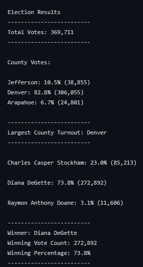

# Python_Election_Analysis

## Project Overview:

#### The Colorado Board of Elections has tasked us to do the following:

1. Determine the total number of votes cast
2. Create a complete list of candidates who received votes
3. Calculate the total votes for each candidate
4. Calculate the % of votes receive
5. Provide each county and their total vote count
6. Determine what % of votes each county provided
7. Determine the county with the largest number of votes
8. Determine the winner of the election based on popular vote

## Expected Election Results Outcome:

## Produced Election Results Outcome:

## Resources:

- Source of election data: (election_results.csv)
- Software: Python 3.7.6, Visual Studio Code

## Election Results:

 - Total number of votes cast: 369,711
 
 - Total votes and % of total votes each candidate received:

        Diana DeGette: 73.8% (272,892)
        Charles Casper Stockham: 23.0% (85,213)
        Raymon Anthony Doane: 3.1% (11,606)

 - Largest County Turnout:

    `Denver: 82.8% (306,055)`

- This Elections Winning Candidate:

    `Diana Degette`
 
 
 ## Summary: 
 
 -  All information we were tasked to provide by the Colorado Board of Elections has been answered in our Produced Election Results Outcome and bulletin list above.

- Congratulations to Diana Degette for being the winner of this election receiving 73.8% of votes totaling an impressive 272,892 votes.
## Election-Audit Python Code Summary:
    The python code provided was robust and can be used for any state wide election given the following:

    1. A seperate CSV file for each election was provides
    2. A seperate election analysis txt file
    3. This code (with some refactoring where neccessary)can be used for any state wide election
